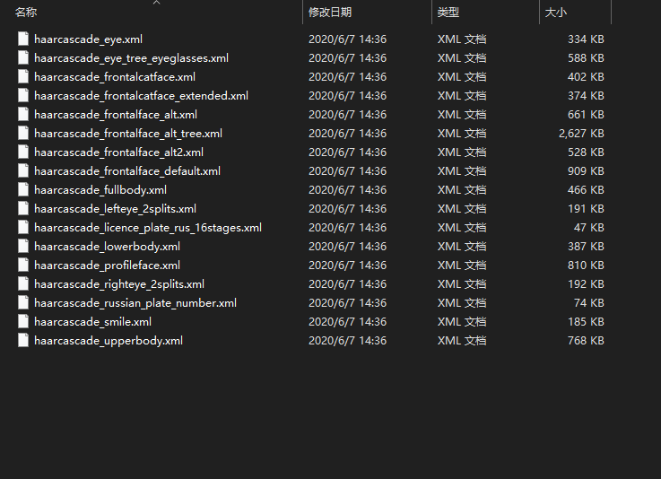

# EyesDetection

一个检测是否闭眼的小呆某，用的OpenCV库。

## 关于分类器

在OpenCV安装文件下，其实已经有很多训练好的模型，可以直接用。本项目所需要使用到的分类器是人脸检测和人眼检测的模型。路径为：OpenCV\opencv\sources\data\haarcascades

实际上，还有基于Cuda的分类模型，不需要大家自己去辛苦训练了哈，毕竟找数据集打标签也是一件很麻烦的事情

## 关于原理

[1] 通过人脸识别和眼睛识别分类器找到人脸和眼睛

[2] 截取人脸部分图像进行处理，通过阈值处理，然后经过腐蚀膨胀处理，这一步的目的是滤波

[3] 检测眼球轮廓，与圆形进行拟合，拟合成功表示睁眼，拟合失败表示闭眼

## 关于效果

### 睁眼效果

### 闭眼效果

## 总结

总的来说，效果一般，光线过暗容易检测不到。因为原理限制，只要是脸部上圆形的都会被检测为眼球，因此当你俯视的时候，会把鼻孔也检测为眼球。

## 关于项目来源

本次项目的思路起源于之前网上看到的一个视频，暂时找不到链接了，作者叫做树莓，但是貌似好久没更新了~